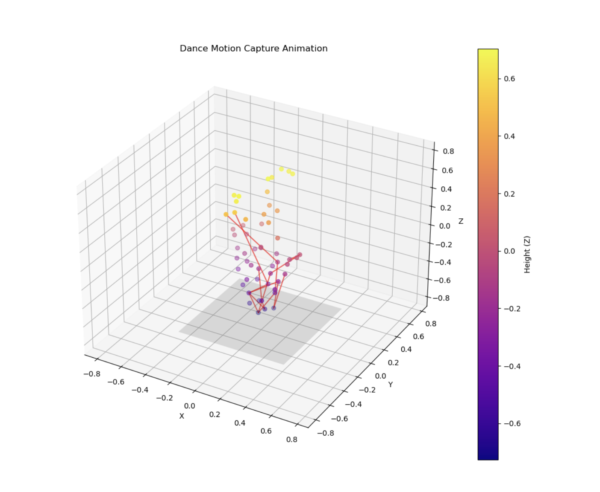
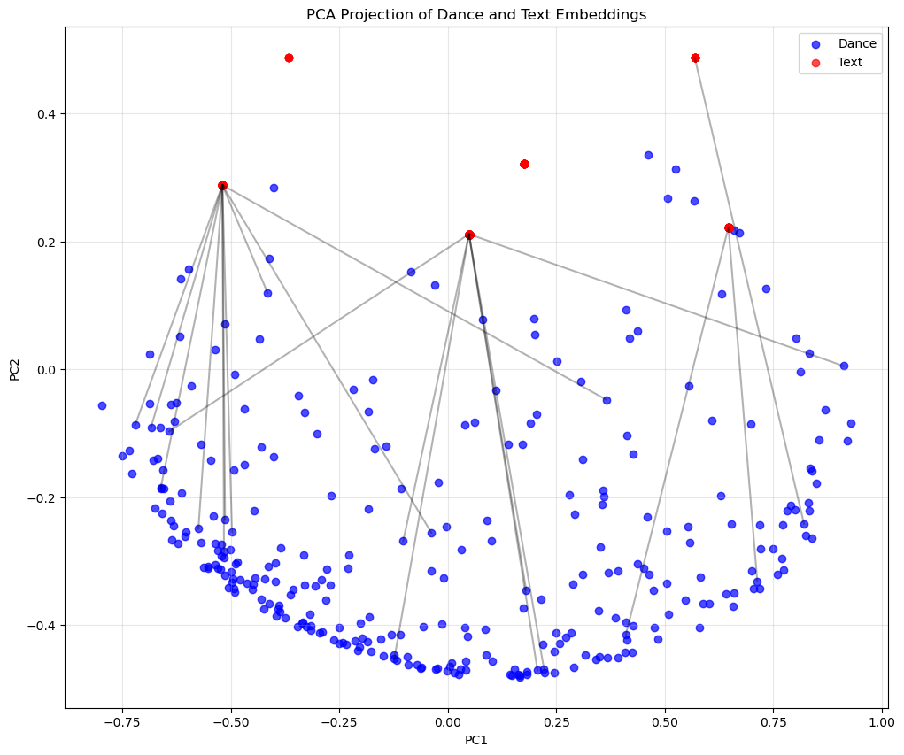

# AI-Enabled Choreography: Dance Beyond Music

## Project Introduction

Hi, I'm Jing Shao. This project is an application test for HumanAI GSoC 2025, exploring the intersection of artificial intelligence and dance art. The project contains two core components:

1. **3D Visualization of Dance Motion Capture Data**: Converting motion capture data in `.npy` format into intuitive three-dimensional animations that display the dancer's movement sequences.
2. **Multimodal Contrastive Learning Between Dance and Text**: Training a model that maps dance movement segments and text descriptions to the same embedding space, enabling bidirectional conversion between text ↔ dance.

Through these two components, the project demonstrates how to use computer vision and natural language processing technologies to understand, visualize, and generate dance content, laying the foundation for AI-assisted choreography and dance analysis.

## Usage Instructions

### Environment Setup

```bash
# Create virtual environment
conda create -n dance python=3.8
conda activate dance
pip install -r requirements.txt
```

### Run Dance Visualization

```bash
# Run dance visualization notebook
jupyter notebook dance_visualization.ipynb
jupyter notebook 2_visualization.ipynb
```

### Train Multimodal Model

```bash
# Run model training notebook
jupyter 4_model_training.ipynb
```

## Dance Visualization Showcase

This project implements 3D visualization of dance motion capture data by connecting joint points into a skeleton and adding enhanced features such as motion trajectories to make dance movements more intuitive.



*Enhanced visualization with motion trajectories and color coding*

Key features of the visualization:
- Implemented based on Matplotlib and mplot3d, compatible with Jupyter environment
- Supports dance sequences of any length
- Automatic joint connections to form human skeleton
- Color coding to distinguish different body parts
- Optional motion trajectory display
- Multi-angle viewing support

For detailed information about the visualization implementation, please refer to [Dance Visualization Details](docs/visualization_details.md).

## Multimodal Model

This project implements contrastive learning between dance movements and text descriptions, using a dual-encoder architecture to map both modalities to a shared embedding space.

### Model Architecture


*Dance-text contrastive learning model architecture*

The model includes two core components:
1. **Dance Encoder**: Combines convolution and GRU to process spatiotemporal features of dance sequences
2. **Text Encoder**: Based on pre-trained language models, fine-tuned for dance descriptions

Main configurations:
- Sequence length: 30 frames (approximately 1 second of movement)
- Embedding dimension: 256
- Batch size: 32
- Learning rate: 3e-4
- Temperature coefficient: 0.07

For detailed information about model architecture and training, please refer to [Model Architecture Description](docs/model_architecture.md).

### Label Generation

Since dance data doesn't come with readily available text labels, I adopted a semi-supervised approach to create labels:

1. Manually annotate ~1% of representative dance segments
2. Calculate sequence similarity using DTW algorithm
3. Automatically generate labels for the remaining data based on similarity


*Semi-supervised labeling process flowchart*


*t-SNE visualization of dance sequence clusters*


*Dance sequences colored by automatically generated labels*

For detailed methods of label generation, please refer to [Labeling Approach](docs/labeling_approach.md).

### Training Results


*Training and validation loss and accuracy curves*


*PCA projection of dance and text embeddings with matching pairs connected*


*Similarity matrix between dance and text embeddings*

## Application Examples

### Example 1: Text to Dance

Input text: **"Fast spin followed by slowly raising both arms"**

Generated dance sequence:


*Dance sequence generated from text*

### Example 2: Dance to Text

Text queries and their matching dance sequences with similarity scores:
Dance Sequence 299:
Top matches:
  1. "sharp swing with feet moving high" (score: 0.8847)
  2. "fluid stretch with arms moving diagonal" (score: 0.8847)
  3. "direct step with feet moving middle" (score: 0.8847)


*Input dance sequence*


## File Structure

```
choreo-ai-project/
│
├── README.md                    # Main project documentation
├── why_this_project.md          # Project interest statement
├── requirements.txt             # Project dependencies
├── assets/                      # Images, GIFs, and other resource files
├── data/                        # Dance motion capture data
│
├── notebooks/
│   ├── 1_data_exploration.ipynb     # Loading and exploring motion capture data
│   ├── 2_visualization.ipynb        # Dance sequence visualization
│   ├── 3_sequence_labeling.ipynb    # Creating and propagating labels
│   ├── 4_model_training.ipynb       # Contrastive learning model training
│   └── 5_generation_examples.ipynb  # Examples of text-to-dance and dance-to-text
│
├── src/
│   ├── data/
│   │   ├── loader.py                # Functions to load and preprocess .npy files
│   │   └── sequence_utils.py        # Utils for creating fixed-length sequences
│   │
│   ├── visualization/
│   │   └── animator.py              # 3D animation functions for dance sequences
│   │
│   ├── labeling/
│   │   ├── feature_extractor.py     # Extract features from dance sequences
│   │   └── label_propagation.py     # Semi-supervised labeling functions
│   │
│   ├── model/
│   │   ├── encoders.py              # Dance and text encoder models
│   │   ├── loss.py                  # Contrastive loss implementations
│   │   └── trainer.py               # Model training functions
│   │
│   └── generation/
│       ├── dance_from_text.py       # Generate dance from text input
│       └── text_from_dance.py       # Generate text from dance sequence
│
├── results/
│   ├── animations/                  # Saved dance animations (GIFs/videos)
│   ├── figures/                     # Plots and visualizations
│   ├── models/                      # Saved model checkpoints
│   └── embeddings/                  # Saved embeddings for analysis
│
├── data/
│   └── processed/                   # Preprocessed data (sequences, labels, etc.)
│
└── docs/                            # Detailed technical documentation
    ├── visualization_details.md     # Visualization details
    ├── model_architecture.md        # Model architecture description
    └── labeling_approach.md         # Labeling methodology
```

## Future Plans

The current implementation has some limitations. Future improvement directions include:

1. **Larger-scale annotation**: Increase the number of manually annotated samples to improve label quality
2. **Style transfer**: Add style disentanglement components to enable conversion between different dance styles
3. **Integration with music**: Incorporate music features to enable music-driven dance generation
4. **Higher quality dance generation**: Optimize the naturalness and coherence of model-generated dances
5. **Real-time interactive system**: Build an interface that allows users to interact with the system in real-time

## Acknowledgments

Special thanks to the HumanAI GSoC project team for providing this interesting testing opportunity, and to the choreo-graph and pirounet projects for providing reference code and documents.