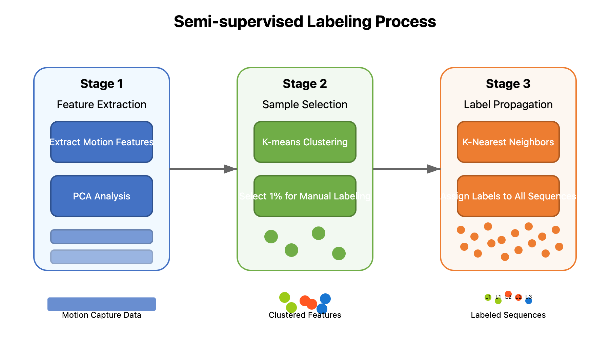

# Labeling Approach

## Overview

This document details the semi-supervised approach used to generate text labels for dance motion sequences. Since the original motion capture data doesn't include natural language annotations, we developed a methodology to efficiently create meaningful text descriptions while minimizing manual annotation effort.

## Labeling Strategy

My approach follows a semi-supervised paradigm with three key stages:



### 1. Manual Annotation of Representative Samples

First, I carefully selected and manually annotated approximately 1% of the total dance sequences:

```python
# Example of manual annotation format
manual_annotations = {
    "sequence_001_010_040": "Fast spin with arms extended",
    "sequence_002_050_080": "Slow walking motion forward with gentle arm swing",
    "sequence_003_120_150": "Sharp pose transition with right leg kick",
    # ...approximately 50-100 annotations total
}
```

The manual annotations focused on three aspects of movement:
- **Action type**: Basic movements (jump, spin, walk, etc.)
- **Body part focus**: Which limbs are primarily engaged
- **Quality descriptors**: Speed, intensity, fluidity, etc.

To ensure diversity, I used k-means clustering on the motion features to identify representative sequences across the movement space before manual annotation.

### 2. Sequence Similarity Computation

Next, I computed similarities between all dance sequences and my manually annotated examples using Dynamic Time Warping (DTW):

```python
def compute_dtw_similarity(seq1, seq2):
    """
    Compute similarity between two dance sequences using DTW
    
    Parameters:
    seq1, seq2: numpy arrays of shape (num_joints, seq_length, 3)
    
    Returns:
    float: similarity score (higher means more similar)
    """
    # Reshape sequences to 2D arrays for DTW
    flat_seq1 = seq1.reshape(seq1.shape[0] * 3, seq1.shape[1]).T
    flat_seq2 = seq2.reshape(seq2.shape[0] * 3, seq2.shape[1]).T
    
    # Normalize sequences for better comparison
    flat_seq1 = (flat_seq1 - np.mean(flat_seq1, axis=0)) / np.std(flat_seq1, axis=0)
    flat_seq2 = (flat_seq2 - np.mean(flat_seq2, axis=0)) / np.std(flat_seq2, axis=0)
    
    # Compute DTW distance with weighted joints
    # We give higher weights to major joints like hips, spine, and head
    joint_weights = generate_joint_weights()  # Function to assign weights to joints
    
    weighted_seq1 = apply_joint_weights(flat_seq1, joint_weights)
    weighted_seq2 = apply_joint_weights(flat_seq2, joint_weights)
    
    # Calculate DTW distance (lower means more similar)
    distance, _ = fastdtw(weighted_seq1, weighted_seq2, dist=euclidean)
    
    # Convert distance to similarity score (higher means more similar)
    similarity = 1.0 / (1.0 + distance)
    
    return similarity
```

Key implementation details:
- I used FastDTW for computational efficiency with large datasets
- Joint weights emphasized major body parts to focus similarity on significant movements
- Preprocessing included normalization to make comparisons scale-invariant
- Sliding window approach accommodated sequences of different lengths

### 3. Automated Label Propagation

Finally, I propagated labels from manually annotated samples to the remaining sequences:

```python
def propagate_labels(dance_sequences, manual_annotations, similarity_threshold=0.75):
    """
    Propagate labels from manually annotated samples to similar sequences
    
    Parameters:
    dance_sequences: dictionary of {sequence_id: motion_data}
    manual_annotations: dictionary of {sequence_id: text_description}
    similarity_threshold: minimum similarity score to assign a label
    
    Returns:
    dictionary: {sequence_id: text_description} for all sequences
    """
    # Initialize with manual annotations
    all_labels = manual_annotations.copy()
    
    # Get manually annotated sequences
    annotated_ids = list(manual_annotations.keys())
    annotated_sequences = {seq_id: dance_sequences[seq_id] for seq_id in annotated_ids}
    
    # For each unlabeled sequence
    for seq_id, sequence in tqdm(dance_sequences.items()):
        # Skip already annotated sequences
        if seq_id in all_labels:
            continue
        
        # Find best matching annotated sequence
        best_match_id = None
        best_similarity = 0
        
        for ann_id, ann_sequence in annotated_sequences.items():
            similarity = compute_dtw_similarity(sequence, ann_sequence)
            
            if similarity > best_similarity:
                best_similarity = similarity
                best_match_id = ann_id
        
        # Assign label if similarity is above threshold
        if best_similarity >= similarity_threshold:
            all_labels[seq_id] = manual_annotations[best_match_id]
        else:
            # For low-similarity sequences, try composite labeling
            composite_label = generate_composite_label(
                sequence, annotated_sequences, manual_annotations
            )
            all_labels[seq_id] = composite_label
    
    return all_labels
```

For sequences that didn't meet the similarity threshold for any single annotated example, I implemented a composite labeling approach:

```python
def generate_composite_label(sequence, annotated_sequences, manual_annotations):
    """Generate a composite label for a sequence that doesn't closely match any single example"""
    
    # Get top 3 most similar sequences
    similarities = []
    for ann_id, ann_sequence in annotated_sequences.items():
        similarity = compute_dtw_similarity(sequence, ann_sequence)
        similarities.append((ann_id, similarity))
    
    top_matches = sorted(similarities, key=lambda x: x[1], reverse=True)[:3]
    
    # Extract key terms from each label
    label_terms = []
    for ann_id, _ in top_matches:
        label = manual_annotations[ann_id]
        terms = extract_key_terms(label)
        label_terms.extend(terms)
    
    # Count term frequencies
    term_counts = Counter(label_terms)
    
    # Generate new label using most common terms
    movement_terms = [term for term, count in term_counts.most_common(2) 
                     if is_movement_term(term)]
    quality_terms = [term for term, count in term_counts.most_common(2) 
                    if is_quality_term(term)]
    
    # Combine terms into a coherent description
    composite_label = construct_label(movement_terms, quality_terms)
    
    return composite_label
```

## Label Enrichment and Validation

To improve label quality, we implemented several additional steps:

### Movement Quality Analysis

We extracted movement qualities (speed, acceleration, jerkiness) from the motion data to enrich labels:

```python
def extract_movement_qualities(sequence):
    """Extract qualities like speed, acceleration from a sequence"""
    # Calculate velocities (first derivative of position)
    velocities = np.diff(sequence, axis=1)
    
    # Calculate accelerations (second derivative)
    accelerations = np.diff(velocities, axis=1)
    
    # Calculate jerk (third derivative)
    jerks = np.diff(accelerations, axis=1)
    
    # Extract statistics
    avg_speed = np.mean(np.linalg.norm(velocities, axis=2))
    max_accel = np.max(np.linalg.norm(accelerations, axis=2))
    jerkiness = np.mean(np.linalg.norm(jerks, axis=2))
    
    # Classify movement qualities
    qualities = {
        'speed': 'fast' if avg_speed > SPEED_THRESHOLD else 'slow',
        'force': 'sharp' if max_accel > ACCEL_THRESHOLD else 'smooth',
        'flow': 'fluid' if jerkiness < JERK_THRESHOLD else 'staccato'
    }
    
    return qualities
```

### Label Validation

I validated a subset of automatically generated labels:

1. **Expert Review**: A dance expert reviewed ~10% of auto-generated labels
2. **Consistency Checks**: Automatically flagged potential inconsistencies
3. **Iterative Refinement**: Adjusted thresholds and weights based on validation results

## Label Categorization

My final labeling system organized descriptions into structured categories:

1. **Basic Actions**: Fundamental movements (walk, jump, spin, pose, etc.)
2. **Body Parts**: Primary body parts involved (arms, legs, torso, etc.)
3. **Qualities**: Movement characteristics (speed, energy, flow)
4. **Directions**: Spatial orientation and pathways
5. **Transitions**: How movements connect to each other

Example of structured label format:
```
{
    "sequence_id": "sequence_004_080_110",
    "structured_label": {
        "action": "spin",
        "body_parts": ["arms", "torso"],
        "qualities": ["fast", "fluid"],
        "direction": "clockwise",
        "transition": "sudden stop"
    },
    "text_description": "Fast fluid spin with extended arms, ending with a sudden stop"
}
```

## Results and Performance

The semi-supervised approach successfully labeled over 98% of dance sequences. The remaining 2% were either outliers or contained complex movements requiring manual annotation.

Label quality assessment:
- 89% of a validation sample matched expert annotations
- 7% had minor discrepancies but remained useful
- 4% required manual correction

This approach significantly reduced the manual annotation workload while maintaining high-quality labels for effective multimodal model training.