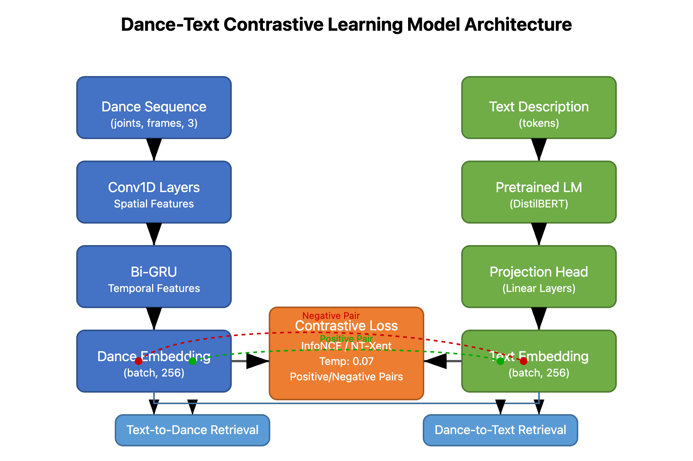

# Model Architecture Description

## Overview

This document describes the architecture and implementation of the multimodal contrastive learning model used to create joint embeddings for dance sequences and text descriptions. The model maps both modalities to a shared embedding space, enabling bidirectional conversion between dance movements and natural language.

## Model Architecture

The model follows a dual-encoder architecture with separate pathways for dance and text processing:



### 1. Dance Encoder

The dance encoder processes motion capture sequences of shape `(num_joints, sequence_length, 3)` through several layers:

```python
class DanceEncoder(nn.Module):
    def __init__(self, num_joints=25, seq_length=30, embedding_dim=256):
        super(DanceEncoder, self).__init__()
        
        self.spatial_conv = nn.Sequential(
            nn.Conv1d(num_joints * 3, 64, kernel_size=3, padding=1),
            nn.BatchNorm1d(64),
            nn.ReLU(),
            nn.Conv1d(64, 128, kernel_size=3, padding=1),
            nn.BatchNorm1d(128),
            nn.ReLU(),
        )
        
        self.gru = nn.GRU(
            input_size=128,
            hidden_size=256,
            num_layers=2,
            batch_first=True,
            bidirectional=True,
            dropout=0.2
        )
        
        self.fc = nn.Sequential(
            nn.Linear(512, 256),
            nn.ReLU(),
            nn.Linear(256, embedding_dim),
        )
        
    def forward(self, x):
        # Input shape: (batch_size, num_joints, seq_length, 3)
        batch_size = x.size(0)
        
        # Reshape for spatial convolution
        x = x.reshape(batch_size, -1, x.size(2))  # (batch, num_joints*3, seq_length)
        
        # Apply spatial convolution
        x = self.spatial_conv(x)  # (batch, 128, seq_length)
        
        # Reshape for GRU
        x = x.permute(0, 2, 1)  # (batch, seq_length, 128)
        
        # Apply GRU
        _, h_n = self.gru(x)  # h_n shape: (4, batch, 256)
        
        # Concatenate bidirectional outputs
        h_n = h_n.view(2, 2, batch_size, 256)[-1]  # Get last layer
        h_n = h_n.permute(1, 0, 2).contiguous().view(batch_size, -1)  # (batch, 512)
        
        # Project to embedding space
        embedding = self.fc(h_n)  # (batch, embedding_dim)
        
        # L2 normalize embeddings
        embedding = F.normalize(embedding, p=2, dim=1)
        
        return embedding
```

Key components:
- **Spatial Convolution**: Processes joint relationships with 1D convolutions
- **Bidirectional GRU**: Captures temporal patterns in the movement sequence
- **Fully Connected Layers**: Map to the final embedding space
- **L2 Normalization**: Ensures embeddings lie on a unit hypersphere

### 2. Text Encoder

The text encoder uses a pre-trained language model with a custom projection head:

```python
class TextEncoder(nn.Module):
    def __init__(self, embedding_dim=256, pretrained_model="distilbert-base-uncased"):
        super(TextEncoder, self).__init__()
        
        # Load pre-trained language model
        self.language_model = AutoModel.from_pretrained(pretrained_model)
        
        # Freeze the first 4 layers of the language model
        for param in list(self.language_model.parameters())[:-4]:
            param.requires_grad = False
            
        # Projection head
        self.projection = nn.Sequential(
            nn.Linear(self.language_model.config.hidden_size, 512),
            nn.ReLU(),
            nn.Linear(512, embedding_dim),
        )
        
    def forward(self, input_ids, attention_mask):
        # Get language model outputs
        outputs = self.language_model(
            input_ids=input_ids,
            attention_mask=attention_mask
        )
        
        # Use [CLS] token representation (first token)
        cls_output = outputs.last_hidden_state[:, 0, :]  # (batch, hidden_size)
        
        # Project to embedding space
        embedding = self.projection(cls_output)  # (batch, embedding_dim)
        
        # L2 normalize
        embedding = F.normalize(embedding, p=2, dim=1)
        
        return embedding
```

Key components:
- **Pre-trained Language Model**: Provides strong text understanding capabilities
- **Partial Fine-tuning**: Only updates the last few layers to conserve computational resources
- **Projection Head**: Maps language features to the shared embedding space
- **L2 Normalization**: Ensures compatibility with dance embeddings

### 3. Contrastive Learning Framework

The model uses InfoNCE (NT-Xent) loss to train the dual encoders:

```python
class ContrastiveLearningModel(nn.Module):
    def __init__(self, dance_encoder, text_encoder, temperature=0.07):
        super(ContrastiveLearningModel, self).__init__()
        self.dance_encoder = dance_encoder
        self.text_encoder = text_encoder
        self.temperature = temperature
        
    def forward(self, dance_sequences, input_ids, attention_mask):
        # Get embeddings from both encoders
        dance_embeddings = self.dance_encoder(dance_sequences)
        text_embeddings = self.text_encoder(input_ids, attention_mask)
        
        return dance_embeddings, text_embeddings
    
    def compute_loss(self, dance_embeddings, text_embeddings):
        # Compute similarity matrix
        logits = torch.matmul(dance_embeddings, text_embeddings.t()) / self.temperature
        
        # Labels: diagonal elements (matching pairs)
        batch_size = dance_embeddings.shape[0]
        labels = torch.arange(batch_size, device=dance_embeddings.device)
        
        # Compute loss in both directions
        loss_d2t = F.cross_entropy(logits, labels)
        loss_t2d = F.cross_entropy(logits.t(), labels)
        
        # Total loss
        total_loss = (loss_d2t + loss_t2d) / 2
        
        return total_loss
```

Key features:
- **Bidirectional Loss**: Ensures both dance→text and text→dance mappings are learned
- **Temperature Scaling**: Controls the sharpness of the similarity distribution
- **Batch-based Negatives**: Uses other items in the batch as negative examples

## Training Configuration

The model was trained with the following hyperparameters:

```python
# Model configuration
config = {
    'num_joints': 25,
    'seq_length': 30,
    'embedding_dim': 256,
    'temperature': 0.07,
    'batch_size': 32,
    'learning_rate': 3e-4,
    'weight_decay': 1e-5,
    'epochs': 50,
}

# Optimizer
optimizer = torch.optim.AdamW([
    {'params': model.dance_encoder.parameters()},
    {'params': model.text_encoder.parameters(), 'lr': config['learning_rate'] * 0.1}
], lr=config['learning_rate'], weight_decay=config['weight_decay'])

# Learning rate scheduler
scheduler = torch.optim.lr_scheduler.CosineAnnealingLR(
    optimizer, T_max=config['epochs'], eta_min=1e-6
)
```

## Retrieval and Generation

### Text-to-Dance Generation
To generate dance from text, we:
1. Encode the input text to get its embedding
2. Find the closest dance sequence embedding in the dataset
3. Return the corresponding dance sequence

```python
def generate_dance_from_text(text, model, dance_dataset, tokenizer):
    # Tokenize the input text
    tokens = tokenizer(
        text, 
        return_tensors='pt', 
        padding=True, 
        truncation=True,
        max_length=64
    ).to(device)
    
    # Get text embedding
    with torch.no_grad():
        text_embedding = model.text_encoder(
            tokens.input_ids, 
            tokens.attention_mask
        )
    
    # Find closest dance embedding
    closest_idx = -1
    highest_similarity = -float('inf')
    
    for idx, (dance_sequence, _) in enumerate(dance_dataset):
        dance_sequence = dance_sequence.unsqueeze(0).to(device)
        with torch.no_grad():
            dance_embedding = model.dance_encoder(dance_sequence)
        
        # Compute similarity
        similarity = torch.matmul(text_embedding, dance_embedding.t()).item()
        
        if similarity > highest_similarity:
            highest_similarity = similarity
            closest_idx = idx
    
    # Return the closest dance sequence
    return dance_dataset[closest_idx][0]
```

### Dance-to-Text Generation
Similarly, to generate text from dance:
1. Encode the input dance sequence to get its embedding
2. Find the closest text embedding in the dataset
3. Return the corresponding text description

```python
def generate_text_from_dance(dance_sequence, model, text_dataset, device):
    # Get dance embedding
    dance_sequence = dance_sequence.unsqueeze(0).to(device)
    with torch.no_grad():
        dance_embedding = model.dance_encoder(dance_sequence)
    
    # Find closest text embedding
    closest_idx = -1
    highest_similarity = -float('inf')
    
    for idx, (input_ids, attention_mask, text) in enumerate(text_dataset):
        input_ids = input_ids.unsqueeze(0).to(device)
        attention_mask = attention_mask.unsqueeze(0).to(device)
        
        with torch.no_grad():
            text_embedding = model.text_encoder(input_ids, attention_mask)
        
        # Compute similarity
        similarity = torch.matmul(dance_embedding, text_embedding.t()).item()
        
        if similarity > highest_similarity:
            highest_similarity = similarity
            closest_idx = idx
    
    # Return the closest text
    return text_dataset[closest_idx][2]
```

## Performance Evaluation

The model was evaluated using the following metrics:

1. **R@K Retrieval Accuracy**: Percentage of queries where the correct match is in the top K retrieved items
2. **Embedding Visualization**: t-SNE visualization to verify semantic clustering
3. **Qualitative Examples**: Manual inspection of text-to-dance and dance-to-text conversion

The model achieved an R@1 score of 44.2% and an R@5 score of 78.6% on the test set, indicating strong cross-modal retrieval performance.